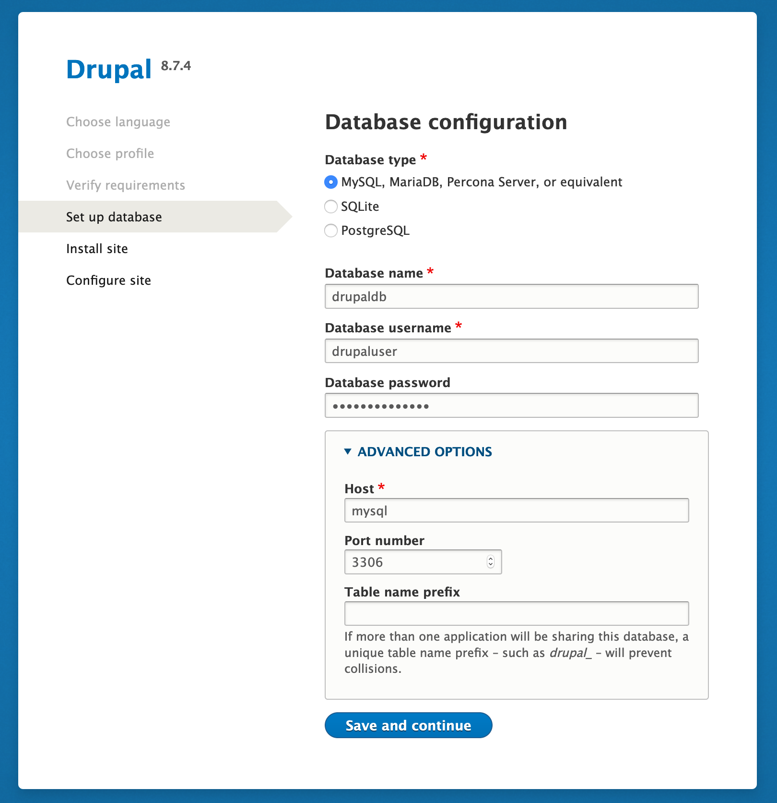

# Drupal 8 Docker Development Environment

This repo contains Dockerfiles and a docker-compose.yml which can be used to 
spin up a Drupal 8 development environment in Docker containers. The Drupal 8
development environments consists of three interconnected containers: A MySQL
database container, a Drupal 8 container and a NGINX web server container.

# Table of Contents

* [Pre-Requisites](#pre-requisites)
* [Docker Installation](#docker-installation)
  * [Setting up Docker on Linux](#setting-up-docker-on-linux)
  * [Setting up Docker on Mac](#setting-up-docker-on-mac)
  * [Setting up Docker on Windows](#setting-up-docker-on-windows)
  * [Verifying Your Docker Installation](#verifying-your-docker-installation)
* [Configuration](#configuration)
  * [NGINX](#nginx)
  * [Drupal](#drupal)
  * [MySQL](#mysql)
    * [Importing a Database Dump](#importing-a-database-dump)
    * [Creating a new Drupal Database](#creating-a-new-drupal-database)
* [Using the Development Environment](#using-the-development-environment)
  * [Which docker-compose.yml should I use?](#which-docker-compose.yml-should-i-use?)
  * [Using the Vanilla Drupal Development Environment](#using-the-vanilla-drupal-development-environment)
  * [Using the Drupal Development Environment for an Exisiting Site](#using-the-drupal-development-environment-for-an-existing-site)


# Pre-Requisites

To utilize the Drupal 8 Docker development environment, the following software
must be availble on the host where the the environment is to be deployed.

* Docker
* docker-compose

# Docker Installation

## Setting up Docker on Linux

### Installing Docker

Docker-CE may be easily installed from package repositories on CentOS, Debian,
Fedora and Ubuntu systems. Please see the specific installation instructions 
for your Linux distribution on [this page](https://docs.docker.com/install/).

### Installing docker-compose

docker-compose may be installed on Linux by following the instructions on
[this page](https://docs.docker.com/compose/install/).

## Setting up Docker on Mac

### Installing Docker

Install Docker Desktop for Mac. See [this page](https://docs.docker.com/docker-for-mac/install/) 
for detailed installation instructions.

### Installing docker-compose

docker-compose is automatically installed alongside Docker Desktop for Mac.

## Setting up Docker on Windows

### Installing Docker

Install Docker Desktop for Windows. See [this page](https://docs.docker.com/docker-for-windows/install/)
for detailed installation instructions.

### Installing docker-compose

docker-compose is automatically installed alongside Docker Desktop for Windows.

## Verifying Your Docker Installation

The Docker and docker-compose installation may be verified by running the 
following commands in a command line terminal.

```bash
# Verify that Docker is working correctly.
$ docker run --rm hello-world:latest
Unable to find image 'hello-world:latest' locally
latest: Pulling from library/hello-world
1b930d010525: Pull complete
Digest: sha256:6540fc08ee6e6b7b63468dc3317e3303aae178cb8a45ed3123180328bcc1d20f
Status: Downloaded newer image for hello-world:latest

Hello from Docker!
This message shows that your installation appears to be working correctly.

To generate this message, Docker took the following steps:
 1. The Docker client contacted the Docker daemon.
 2. The Docker daemon pulled the "hello-world" image from the Docker Hub.
    (amd64)
 3. The Docker daemon created a new container from that image which runs the
    executable that produces the output you are currently reading.
 4. The Docker daemon streamed that output to the Docker client, which sent it
    to your terminal.

To try something more ambitious, you can run an Ubuntu container with:
 $ docker run -it ubuntu bash

Share images, automate workflows, and more with a free Docker ID:
 https://hub.docker.com/

For more examples and ideas, visit:
 https://docs.docker.com/get-started/

# Verify that docker-compose is installed and available.
$ docker-compose --version
docker-compose version 1.23.2, build 1110ad01
```

If these commands do not succeed, please review the Docker installation
instructions for your platform and try re-installing.

# Configuration

This section outlines the configuration for the three containers that
constitute the Drupal 8 Docker development environment.

## NGINX

The Drupal 8 Docker development environment utilizes an NGINX 1.17 container as 
its frontend web server.

The environment variables set in the NGINX container may be viewed in the 
[nginx.env](nginx/resources/nginx.env) file.

The NGINX server block for the Drupal application may be viewed in the
[default.conf](nginx/resources/default.conf) file.

## Drupal

The environment variables set in the Drupal container may be viewed in the 
[drupal.env](drupal/resources/nginx.env) file.

## MySQL

The Drupal 8 Docker development environment utilizes a MySQL 8 container as its
backend database.

The environment variables set in the MySQL container may be viewed in the 
[mysql.env](mysql/resources/mysql.env) file.

### Importing a Database Dump

If a SQL database dump is available, it may be placed under the 
`./mysql/resources/init` directory. When the MySQL container starts, it will 
mount in this directory and automatically import the database dump. The database
dump file must have a `.sql` or `.sql.gz` extension.

By default, the database dump will be read into the database defined by the 
`MYSQL_DATABASE` enviroment variable specificed in [mysql.env](mysql/resources/mysql.env#L2).

The database dump will only be imported during a fresh deployment of the MySQL
container. Please see [Starting a Fresh Environment](#starting-a-fresh-environment)
for more information on how to build a fresh MySQL container.

### Creating a new Drupal Database

If no database dump is available, a fresh Drupal database may be created by 
following the Drupal installation guide.

On the "Set up database" step of the Drupal installation, input the Drupal database
name, user and password as defined in [mysql.env](mysql/resources/mysql.env). The
database name should be the value of `MYSQL_DATABASE`, the user should be the 
value of `MYSQL_USER` and the password should be the value of `MYSQL_PASSWORD`.
Under advanced options, set the "Host" option to `mysql` to match the name of 
the MySQL service.



# Using the Development Environment

## Which docker-compose.yml should I use?

The default `docker-compose.yml` will build out a Drupal 8 development environment
and mount in an existing Drupal 8 site. Use this docker-compose.yml when you 
want to develop against an existing site.

`docker-compose.vanilla.yml` will build out a plain Drupal 8 development 
environment with no existing site. Use this docker-compose.yml when you want 
to create a Drupal 8 development environment with no existing data.

To use `docker-compose.vanilla.yml`, be sure to include `-f docker-compose.vanilla.yml`
when you invoke `docker-compose` so that the vanilla docker-compose.yml is targeted.

## Using the Vanilla Drupal Development Environment

### Starting the Development Environment

The vanilla Drupal 8 Docker development cluster may be started via `docker-compose`.

```bash
# Execute in the top level directory where docker-compose.yml is.
$ docker-compose -f docker-compose.vanilla.yml up -d --build
```

This command will spin up a MySQL 8 database container, a Drupal 8 container and  
an NGINX web server frontend container.

Once completed, Drupal may be accessed at `http://localhost:8080/index.php`.  
The MySQL database will be available at `localhost:3306`.

### Stopping the Development Environment

The Drupal 8 Docker development cluster may be stopped via `docker-compose`.

```bash
$ docker-compose -f docker-compose.vanilla.yml stop
```

Edits made to the Drupal site and changes made to the MySQL database will be 
persisted across restarts of the Drupal 8 development cluster.

### Accessing Drupal and MySQL Volumes

In the vanilla Drupal development environment, the Drupal directory 
`/var/www/html` and the MySQL data directory `/var/lib/mysql` are exposed and 
persisted on the host via Docker named volumes. This allows the data in these
directories to be persisted across restarts of the development environment.

If you wish to retrieve data from these volumes, you can locate the mount point
on the host via `docker volume inspect`.

```bash
# List out all Docker volumes.
$ docker volume list
DRIVER              VOLUME NAME
local               drupal-8-docker-dev_html
local               drupal-8-docker-dev_mysql-data

# Get the host mountpoint of a Docker volume.
$ docker volume inspect --format '{{ .Mountpoint }}' drupal-8-docker-dev_html
/var/lib/docker/volumes/drupal-8-docker-dev_html/_data
```

### Starting a Fresh Environment

If you wish to start a fresh Drupal 8 Docker development environment, execute
the following commands to remove the persistent volumes for the containers and 
restart them with new volumes. Be sure to copy data you wish to save before
removing the persistent volumes.

```bash 
# Stop all containers and delete persistent volumes.
$ docker-compose -f docker-compose.vanilla.yml down -v

# Restart containers with fresh volumes
$ docker-compose -f docker-compose.vanilla.yml up -d
```

## Using the Drupal Development Environment for an Exisiting Site

TODO

